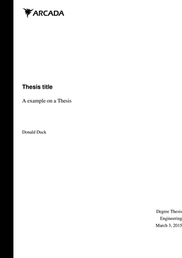

# LaTeX template for Arcada thesis


## Getting started

### Dependencies

texlive-core, texlive-latextra, graphviz, pyxplot, gnuplot texlive-langextra texlive-fontsextra

### Installation

```
git clone https://github.com/oxyc/arcada-thesis-template.git
```

#### Natbib and makebst compatability issue

    ! Extra }, or forgotten \endgroup.
    \par ...m \@noitemerr {\@@par }\fi \else {\@@par }

To fix this error you should add the following lines before your `\begin{document}`

```latex
\renewcommand{\bibAnnoteFile}[1]{%
\IfFileExists{#1}{\begin{quotation}\noindent\texts c{Key:} #1\\
\textsc{Annotation:}\ \input{#1}\end{quotation}}{}}

\renewcommand{\bibAnnote}[2]{%
\begin{quotation}\noindent\textsc{Key:} #1\\
\textsc{Annotation:}\ #2\end{quotation}}
```

### Integrate with your own thesis document

@todo

## Features

- Multilingual (swedish, finnish, english)
- Abstract (translatable)
- Table of Contents
- List of figures
- List of tables
- Fix margins/sizes/spacing etc.
- Makefile

## Macros

@todo

## Todo

- Abbrevations (?)
- Macros for figures/tables/etc.
- Bibliography/Appendices/References
- Proper example
- Proper howto and proper readme
